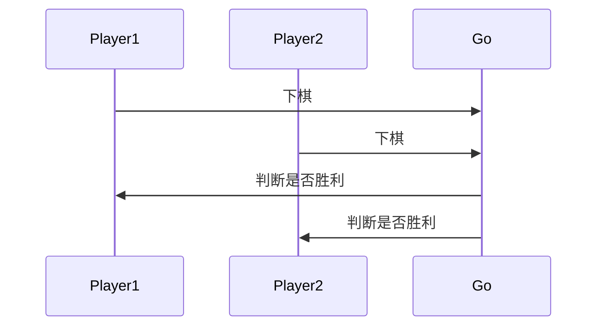
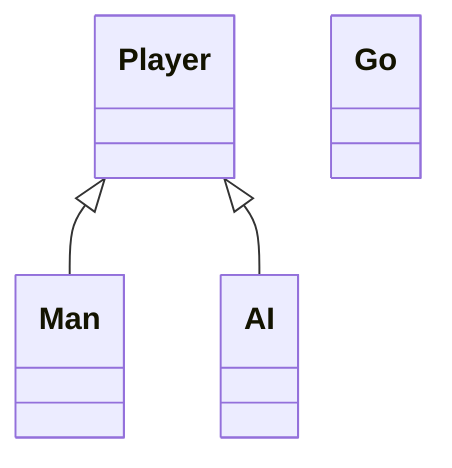
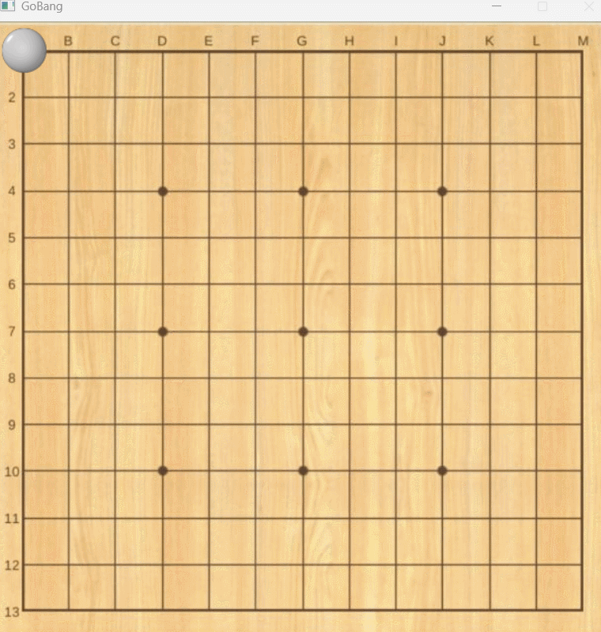
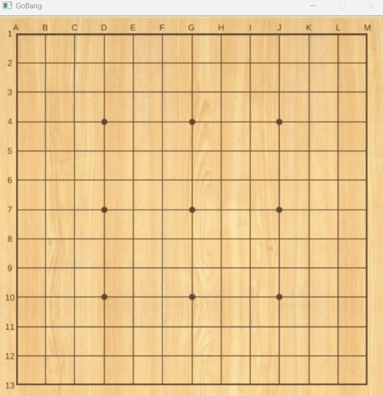

# 五子棋游戏
[English Version](README_en.md)

基于easyx和visual studio 2019的五子棋游戏，支持人机对战和人人对战。有很多素材和资源用不到了，也放在这里供大家进一步去开发。

本项目的亮点是游戏胜利的逻辑判断，AI的决策树算法。

## 环境配置
1. 下载visual studio 2019
2. 下载easyx库，并配置好环境
3. 下载本项目，并打开visual studio 2019，选择打开项目

## 项目架构说明

### 游戏的基本流程


这里的AI可以是任何一个Player的子类。

### 关键的类图



### 游戏判断胜利的算法说明

我们知道五子棋的胜利由最后一手决定，所以，我们只需要判断最后一手是否满足胜利条件即可。在判断过程中，我们判断五子棋四个方向的9个位置，如果有五个跟最后一手颜色相同的棋子，则胜利。

1. 横向判断
2. 纵向判断
3. 左上到右下判断
4. 右上到左下判断

使用伪代码解释一下，这个算法避免了很多重复的计算，平均时间复杂度$O(N)$;
```python
# 这里的start和end是判断的起始和结束位置
for i in range(start, end):
    first = -1
    if color(i) == color(last):
        if first == -1:
            first = i
        else:
            if i - first == 4:
                return True
            else:
                first = i
    else:
        first = -1
    return false
```

### AI的思考算法说明

首先跳过有棋子地方，然后然后让对手在这里落子，根据对方的状态打出不一样的分数，同样的也计算自己的，但是这个时候自己的权重都要更高一点。

## 游戏运行

运行时确保文件在可执行程序下面。

游戏的运行逻辑是双方按左键下棋，右键退出游戏

如果游戏黑屏可以在任意位置下子就可以恢复。

这里给出双人对战的截图



下面是AI运行的结果



## 许可证和其他

本项目采用GPLv3许可证，请查看LICENSE文件。